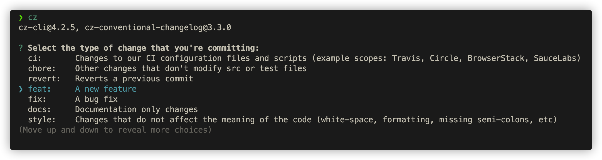

## scripts

包含若干自动化 git 脚本

## hooks

包含若干 git 全局 hook

```bash
git config --global core.hooksPath /path/to/my/hooks
```

## Cz-cli

[Cz-cli](https://github.com/commitizen/cz-cli#making-your-repo-commitizen-friendly) 用于快速生成规范的 git 提交格式。



### 工作流

#### 初始化

> `vol` 详见 [volta](../lang/javascript/README.md#volta)

```bash
vol install -g commitizen #https://github.com/commitizen/cz-cli#conventional-commit-messages-as-a-global-utility

# 设置提交格式
vol install cz-conventional-changelog
touch ~/.czrc
echo '{ "path": "cz-conventional-changelog" }' > ~/.czrc
```

#### 修改提交格式

-   选择格式
    -   查看 [列表](https://github.com/commitizen/cz-cli#making-your-repo-commitizen-friendly)
    -   使用 `volta --list` 查看已安装的格式
    -   [定制提交格式](#定制提交格式)
-   修改 [.czrc](./.czrc)

#### 定制提交格式

使用 [cz-format-extension](https://github.com/tyankatsu0105/cz-format-extension) 定制提交格式。
