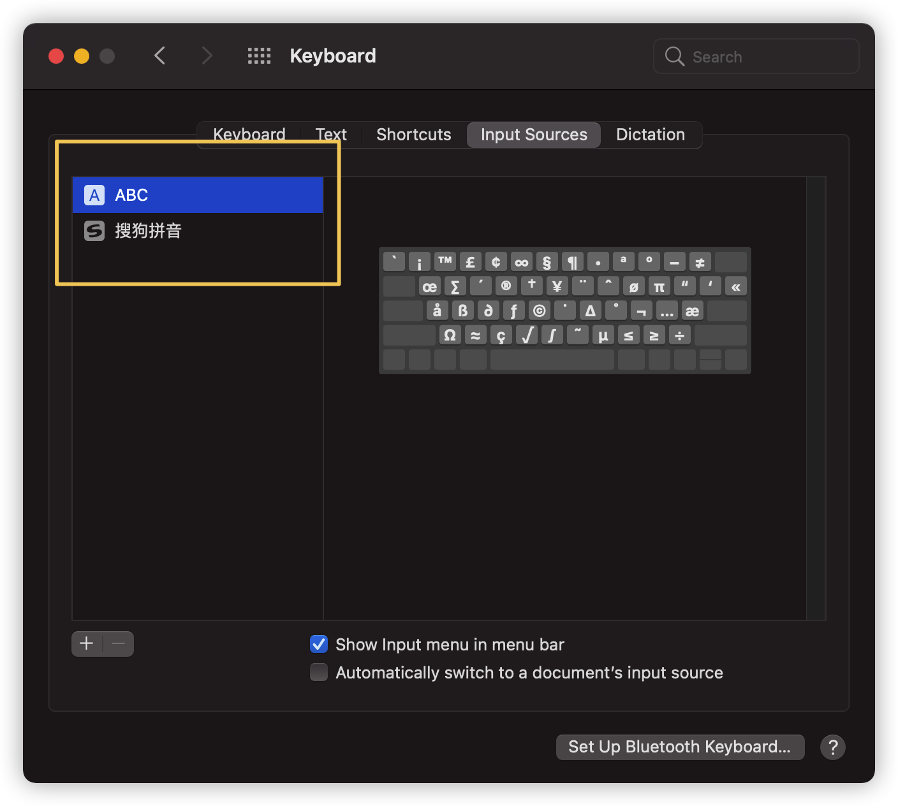

## 快速开始

1. 移除 apple pinyin，仅保留 ABC 和 搜狗输入法 
2. [搜狗输入法皮肤](https://github.com/ssnhd/sogou-skin)：类似 MacOS 原生皮肤效果
3. [Input Source Pro](https://inputsource.pro/)：提示当前输入法中英文
4. 替换中文符号为英文，方便 markdown 编辑。详见 “搜狗输入法>偏好设置>符号替换”
